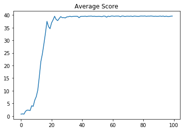

# Implementation Details
In general the code is an implementation of the [DDPG Paper](https://arxiv.org/pdf/1509.02971.pdf), but I made some minor adjustments to make it work in the reacher environment. 
Take a look at **Section 3: Algorithm** and **Section 7: Experiment Details**. 

## The Basic DDPG Algorithm

## Network Architecture
I used the same network architecture, but used only 128 hidden units for both hidden layers in the actor and critic network.
I reduced the number of hidden units, because 128 hidden units had enough capacity to solve the environment and the smaller the network, the faster it trains. 
I tried batch normalization as stated in the paper, but I could not benefit from it. In fact it made the training performance even worse. 
Hence I decided, to not use it. 
The rest of the network architecture is identical to the one in the paper. 

## Trick One: Replay Buffer 
I make use of a replay buffer to decorrelate the experiences. Otherwise, the correlation could lead the agent to diverge.
Similar to the paper I use a replay capacity of 10^6. 

## Trick Two: Target Networks
To decorrelate the targets from the predictions, I use target networks for the actor and the critic. 
This prevents the networks to diverge, as well. As stated in the paper, I update the target networks softly. 

## Stochastic Gradient Descent
For both networks I use the Adam optimizer. In contrast to the paper I use a learning rate of 0.001 for both optimizers and no weight decay for the critic. 
In the paper they used a batch size of 64. But to use more parallel compute capacity, I increased it to 256. 
Additionaly it turned out that updating the networks 10 times after 20 steps was more efficient than updating the networks after each step.

## Exploration - Exploitation
As the name says Deep Deterministic Policy Gradient uses a deterministic policy. However, to not get stuck in a local maximum we want the policy to explore a lot in the beginning and exploit more and more as time goes by. 
In order to do that, we have to make the policy stochastic. To archive that, I added some gaussian noise to the actions and decreased the standard deviation exponentially to a minimum of 0.01. 
In the paper they used the Ornstein-Uhlenbeck Process to generate timely correlated noise. 
However, this process is pretty complex and since gaussian noise works as well, I thought that an ou-process is overkill. 

## Evaluation

This plot shows the average score over 10 episodes. The x-axis describes the number of episodes in steps of ten. So 20 means 200 episodes. 
As we can see the environment is solved after 600 episodes. However, it took not to much time, because the network gets updated only 10 times after 20 steps.
The plot also shows, that the score converges to a limit of 39. 

This plot shows the average score of the actor over 10 episodes. 
We can see that the actor gets better and better faster and faster until it slows down after about 600 episodes when the environment is solved. 

This plot shows the average loss of the critic over 10 episodes. 
We can see, that the loss increases until the environment is solved at about 600 episodes and after that decreases. 

## Future Development
First of all, I did not too much finetuning. So there is room for improvement by adjusting the hyperparameters.
Additionaly, I think one can benefit from batch normalization in this problem, even though I did not find a way to benefit from it. Further one could learn from raw pixels or use multiple agents to solve the environment. 

